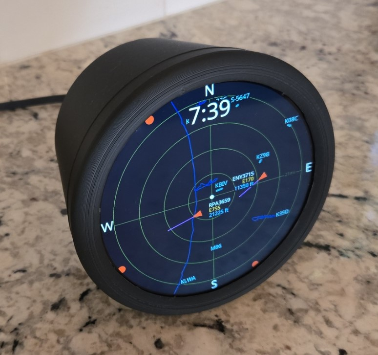

# Plane Radar


**3D printed case (STL + assembly):** [MakerWorld](https://makerworld.com/en/models/2872376-esp32-plane-radar-live-ads-b-on-a-round-display#profileId-3207083) · **Firmware:** [Releases](https://github.com/MatixYo/ESP32-Plane-Radar/releases)

Firmware for an **ESP32-C3 Super Mini** and a **1.28″ round GC9A01** display (240×240). Shows a circular **ADS-B radar** around your configured location, with **WiFiManager** for first-time setup.

> **Also runs on the Adafruit Qualia ESP32-S3 RGB666** driving the 4″ round 720×720 NV3052C panel (Adafruit 5793). Build env `qualia_s3`; the UI auto-scales to 720×720 and control moves to the on-board **TCA9554 buttons** — UP for range, DN for a full-screen status readout. See **[Qualia ESP32-S3](#qualia-esp32-s3-4-720720)** below and **[docs/qualia_display.md](docs/qualia_display.md)**.



## What it does

1. **Wi‑Fi setup** (if needed) — captive portal on AP **`PlaneRadar-Setup`**
2. **Radar** — live aircraft from [adsb.fi](https://opendata.adsb.fi/) on a sonar-style grid

After Wi‑Fi is saved, the device reconnects automatically. ADS-B data is fetched on a background task (~5 s); between fetches the radar **dead-reckons** each aircraft along its track and redraws at ~4 Hz, so motion stays smooth instead of stepping once per fetch. Brief Wi‑Fi drops are ridden out (the radar keeps running) instead of flashing a reconnect screen.

## Controls — ESP32-C3 (BOOT, GPIO 9, active LOW)

| Action | Effect |
|--------|--------|
| **Short tap** | Cycle range preset (3 → 6 → 9 → 12 → 15 → 21 → 30 → 45 mi); saved to flash |
| **Hold 3 s** | Clear Wi‑Fi, location, and units; reboot into setup portal |

During setup you can also hold BOOT at power-on to force a credential reset (same as the long press).

## Qualia ESP32-S3 (4″ 720×720)

The firmware also targets the **Adafruit Qualia ESP32-S3 for RGB666** (5800) with the **4″ round 720×720 NV3052C** panel (5793) — build env `qualia_s3`. The radar UI auto-scales from the 240 px layout to 720×720 (`config::kUiScale`), and output is tear/flicker-free: an esp_lcd RGB panel with two framebuffers + a bounce buffer, drawn zero-copy into the back buffer and presented on VSYNC. Full bring-up, toolchain (IDF 5.x / pioarduino), and RGB tuning notes are in **[docs/qualia_display.md](docs/qualia_display.md)**.

### Controls — TCA9554 buttons

The C3's single BOOT button is an RGB data line on the Qualia, so control moves to the two on-board **TCA9554 buttons** (UP / DN). They're sampled by a background FreeRTOS task (~15 ms), so a tap isn't missed while the main loop is blocked in an ADS-B fetch.

| Button | Gesture | Effect |
|--------|---------|--------|
| **UP** | tap | Range up (next larger preset; wraps) |
| **DN** | tap | Toggle the full-screen **status screen** |
| **DN** | hold 3 s | Clear Wi‑Fi, location, and units; reboot into setup portal |

If the board doesn't populate these buttons, the controls simply never trigger (range still defaults and persists via NVS).

### Status screen (DN tap)

A full-screen readout that overlays the radar and auto-returns after 20 s (`kStatusScreenTimeoutMs`), refreshing ~1 Hz while shown. Tap **DN** again to dismiss and jump straight back to the radar. It shows:

- Wi‑Fi state + signal (RSSI), SSID, and IP address
- **`http://plane-radar.local`**
- Free heap, sketch size, chip temperature, and uptime
- Configured home latitude / longitude

## Wi‑Fi setup portal

**First-time setup** (no saved Wi‑Fi):

1. Connect to **`PlaneRadar-Setup`**
2. Open **`http://plane-radar.local`** (preferred) or **`http://192.168.4.1`** — both are shown on the yellow setup screen; captive portal may open automatically
3. Set home Wi‑Fi, then save

**Reconfigure anytime** (after the device is on your network):

1. Open **`http://plane-radar.local`** or **`http://<device-ip>`** (e.g. from your router or serial log at boot)
2. Change Wi‑Fi, location, units, runway overlay, or clock; save

The same portal runs on the setup AP and on the device’s LAN IP while connected to Wi‑Fi. mDNS hostname is `plane-radar` → **plane-radar.local** (`kPortalHostname` in `config.h`). Some clients resolve `.local` slowly; use the IP if needed.

**Custom fields** (stored in NVS):

| Field | Purpose |
|-------|---------|
| **Latitude / Longitude** | Radar center and ADS-B query position (defaults in `config.h` until set) |
| **Display distances in miles** | Ring scale label in **mi** instead of **km** (e.g. `6mi` vs `10km`) |
| **Show airport runways** | Major-airport runway overlay on the radar (off to hide) |
| **Display clock** | On-screen 12-hour clock: **Off**, **Top**, or **Bottom** (NTP-synced; see [Clock](#clock)) |

After a reset, the device reboots and shows the setup screen immediately (no “Connecting” loop on stale credentials).

## Radar display

### Grid

- Dark blue background, subdued green rings and crosshairs
- White **N / S / E / W** at the bezel; range label on the **east** spoke (ring 3 = ¾ of outer radius)
- White center dot

Layout and colors: `include/ui/radar_theme.h`.

### Range presets

| Ring 3 label | Outer radius (aircraft scale) |
|------------|-------------------------------|
| 3 mi | ~4 mi |
| 6 mi | ~8 mi (default) |
| 9 mi | ~12 mi |
| 12 mi | ~16 mi |
| 15 mi | ~20 mi |
| 21 mi | ~28 mi |
| 30 mi | ~40 mi |
| 45 mi | ~60 mi |

Preset and miles/km choice persist across reboot (`planeradar` NVS namespace).

### Runways

- Large + medium airports from OurAirports globally; small airports within 100 mi of KGRR (Grand Rapids, MI). All open runway strips in range (helipads excluded)
- Teal runway lines with one label per airport (e.g. `KJFK`); toggle in the Wi‑Fi setup portal
- Draw loop pre-filters the dataset to airports within 100 mi of the radar center (rebuilt only when the location changes), then iterates that subset each frame
- Update the embedded list: `python3 scripts/build_large_airports.py` (small-airport region set by `SMALL_REF_IDENT`/`SMALL_RADIUS_MI` in the script)

### Water

- Navy 1 px outlines of major water bodies (lakes, reservoirs, coastline), clipped to the outer ring — always on, no toggle
- Sourced from the **USGS National Hydrography Dataset** (full shoreline detail), pre-filtered to a region around the default radar center and simplified (Douglas–Peucker) into flat lat/lon polylines in `src/data/water_bodies_data.cpp`
- Update the embedded data: `python3 scripts/build_water_bodies.py` (region and minimum water-body area are set near the top of the script)

### Clock

- Optional on-screen **12-hour clock** (`H:MM`), centered just inside the outer ring at the **top** or **bottom** — chosen in the Wi‑Fi setup portal (**Off** / **Top** / **Bottom**), persisted in NVS
- Time comes from **SNTP** once Wi‑Fi is up; servers and timezone are `kNtpServer1` / `kNtpServer2` / `kTimezone` in `config.h` (default timezone `EST5EDT`). The clock stays hidden until the first sync lands

### Aircraft

- **Inside the outer ring** — red heading triangle, magenta speed vector (clipped at the ring), callsign / type / altitude tags
- **Outside the ring** (still within ADS-B fetch) — small **red dot on the screen rim** at the correct bearing (direction cue; not distance-accurate past the ring)
- **Tags** — placed toward the **center**: west (left) → tag on the **right** of the symbol; east (right) → tag on the **left**

As range decreases (or aircraft approach), targets move inward; beyond-ring dots become full symbols when they cross the outer ring.

- **Smooth motion** — positions only refresh on each ADS-B fetch (~5 s), so between fetches each aircraft is **dead-reckoned** forward from its last fix along its ground track (`track_deg`) at its ground speed (`gs_knots`). The radar redraws at `kRadarRedrawIntervalMs` (250 ms, ~4 Hz) and snaps back to real data on the next fetch. The ADS-B `seen_pos` age seeds the extrapolation so a stale fix isn't over-projected.

### ADS-B

- Source: `https://opendata.adsb.fi/api/v3/`
- Fetch radius: `ui::radar::fetchRadiusKm()` — scales with the active preset to roughly the screen edge (so rim dots have data)
- Runs on a **background FreeRTOS task** so the ~1–2 s blocking HTTPS request never stalls the render loop; the task publishes into a shared buffer the radar reads each frame
- Poll interval: `kAdsbFetchIntervalMs` (5 s) in `config.h`
- Ground aircraft hidden by default (`kAdsbShowGroundAircraft`)

## Configuration

Edit **`include/config.h`** for hardware and behavior:

| Area | Keys / notes |
|------|----------------|
| Portal | `kPortalApName`, `kPortalIp`, `kPortalHostname` / `kPortalHostUrl` (mDNS; needs `-DWM_MDNS` in `platformio.ini`) |
| Wi‑Fi timing | connect attempts, reconnect grace, portal timeout (`0` = no timeout), `kWifiRideOutMs` (ride out brief drops) |
| BOOT | `kBootPin`, `kBootResetHoldMs`, `kBootTapMinMs` |
| Display SPI | pins, `kDisplayInvert`, `kDisplayRgbOrder`, `kDisplaySpiWriteHz` |
| Default location | `kDefaultRadarLat`, `kDefaultRadarLon` (until portal overrides) |
| ADS-B | `kAdsbFetchIntervalMs`, `kRadarRedrawIntervalMs` (dead-reckon redraw), `kAdsbShowGroundAircraft` |
| Clock / time | `kNtpServer1`, `kNtpServer2`, `kTimezone` (optional on-screen clock) |
| Status screen (Qualia) | `kStatusRefreshMs`, `kStatusScreenTimeoutMs` |

Range presets: `include/ui/radar_range.h` (`kRangePresets`).

## Project layout

```
include/
  config.h
  hardware/
    lgfx_config.hpp
    display.h
    display_font.h
    qualia_nv3052c.h        — Qualia: NV3052C panel init + TCA9554 buttons
    qualia_rgb.h            — Qualia: esp_lcd RGB output (double-buffer + bounce)
  data/
    large_airports.h
    water_bodies.h
  ui/
    radar_theme.h
    radar_range.h
    radar_display.h
    runway_overlay.h
    water_overlay.h
    status_screens.h
  services/
    wifi_setup.h
    radar_location.h
    adsb_client.h
data/
  ui_font.vlw              — embedded smooth UI font, master 45 px (Noto Sans Regular)
  ui_font_<H>.vlw          — per-size fonts at each exact 720 px radar height (Qualia only)
scripts/
  build_large_airports.py  — regenerate the airport/runway dataset
  build_water_bodies.py     — regenerate the water-body outlines (USGS NHD)
  build_ui_font.py          — regenerate the VLW UI font(s) from a TTF
src/
  main.cpp
  data/
    large_airports_data.cpp
    water_bodies_data.cpp
  hardware/                — display.cpp, display_font.cpp, qualia_nv3052c.cpp, qualia_rgb.cpp
  ui/                      — radar_display, runway_overlay, water_overlay, status_screens, radar_range
  services/
```

## Wiring (GC9A01 ↔ ESP32-C3 Super Mini)

| Display | ESP32-C3 |
|---------|----------|
| VCC | 3V3 |
| GND | GND |
| RST | GPIO **0** |
| CS | GPIO **1** |
| DC | GPIO **10** |
| SDA (MOSI) | GPIO **3** |
| SCL (SCLK) | GPIO **4** |
| BOOT (user) | GPIO **9** |

## Build

```bash
pio run -t upload
pio device monitor
```

- PlatformIO env: **`supermini`** (ESP32-C3) or **`qualia_s3`** (Adafruit Qualia ESP32-S3; see [docs/qualia_display.md](docs/qualia_display.md))
- Serial: **115200** baud
- USB CDC on boot enabled in `platformio.ini` for the Super Mini

### Web-flashable release image

Single `.bin` for [esptool-js](https://espressif.github.io/esptool-js/) and similar tools (ESP32-C3, 4 MB, flash at **0x0**):

```bash
chmod +x scripts/merge-firmware.sh   # once
./scripts/merge-firmware.sh
```

Writes `release/plane-radar-merged.bin`. Skip rebuild if firmware is already built:

```bash
./scripts/merge-firmware.sh --no-build
```

Or via PlatformIO only (output: `.pio/build/supermini/firmware-merged.bin`):

```bash
pio run -e supermini
pio run -t merge -e supermini
```

Put the board in download mode (hold **BOOT**, tap **RESET**), then flash with Chrome/Edge over USB.

### CI and releases (GitHub Actions)

| Workflow | When | Output |
|----------|------|--------|
| [Build](.github/workflows/build.yml) | Push / PR to `main` | Artifact `plane-radar-supermini` (merged + split `.bin` files, ~90 days) |
| [Release](.github/workflows/release.yml) | Git tag `v*` (e.g. `v1.0.0`) | GitHub Release asset `plane-radar-v1.0.0.bin` + `.sha256` |

To ship a version users can download:

```bash
git tag v1.0.0
git push origin v1.0.0
```

The release workflow builds firmware in CI and attaches the merged image to the release. Download from **Releases** on GitHub, then flash at **0x0** (ESP32-C3, 4 MB).

## Dependencies

- [LovyanGFX](https://github.com/lovyan03/LovyanGFX)
- [WiFiManager](https://github.com/tzapu/WiFiManager)
- [ArduinoJson](https://github.com/bblanchon/ArduinoJson)
